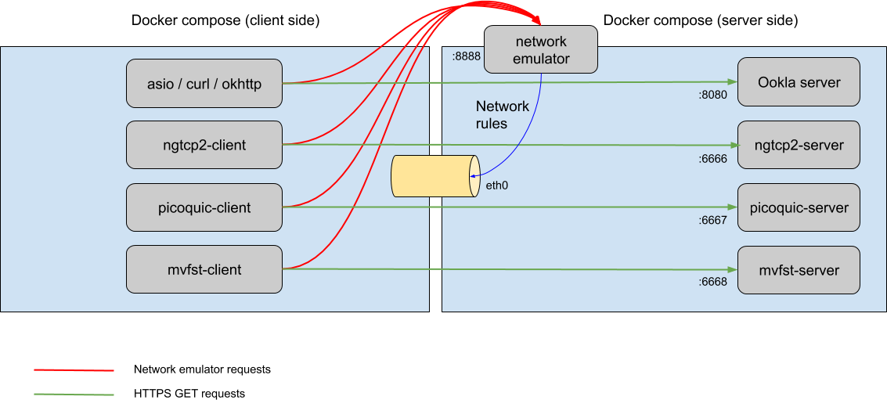

# quic-performance

## QUIC

From https://tools.ietf.org/html/draft-tsvwg-quic-protocol-02

~~~~~
 QUIC (Quick UDP Internet Connection) is a new multiplexed and secure
 transport atop UDP, designed from the ground up and optimized for
 HTTP/2 semantics.  While built with HTTP/2 as the primary application
 protocol, QUIC builds on decades of transport and security
 experience, and implements mechanisms that make it attractive as a
 modern general-purpose transport.  QUIC provides multiplexing and
 flow control equivalent to HTTP/2, security equivalent to TLS, and
 connection semantics, reliability, and congestion control equivalent
 to TCP.
~~~~~

There is a growing number of QUIC implementations. The following link
tracks known implementations of QUIC.

https://github.com/quicwg/base-drafts/wiki/Implementations

## Overview

This project is an attempt to provide a uniform way of testing the
performance of some of these implementations under varying network 
conditions, specially in lossy environments. 

It is divided in three components: client, server and network emulator.
The following image illustrates how these components interact. 

The client and server sit in a docker container, while the network 
emulator is co-located with the server but outside the docker container.
We use docker-compose to orchestrate the execution of both client and server.

Before making it's requests to the server, the client sends a request to 
the network emulator to apply network rules. (The [network emulator](https://gitlab.com/codavel/network-emulator) 
is based on  `tc` and included as a submodule of the project. )

After this, the client makes HTTPS GET requests to the server.

This flow is controlled by a python script (run_demo.py) that is executed 
when the docker-compose is upped. The scripts allows for setting up the 
test parameters  (server ip address, number of runs, latency and 
packet loss rules, bytes to request, ...) via a config file.

For comparison purposes, we also provide a container with a Ookla 
speedtest server and commonly used HTTP clients using curl, boost asio
and OKHttp.

## Setup

You will need two machines  to be able to run the project (client and server),
preferably used only for testing purposes (the network emulator
will apply its rules on a server machine network interface).

Build instructions [here](./BUILD.md)

## Run QUIC benchmark

1. Start the network emulator

~~~~~
cd ${QUIC_PERF_ROOT}/network-emulator/rest_api/
npm start
~~~~~

2. Start the quic server container

E.g. for picoquic

~~~~~
cd ${QUIC_PERF_ROOT}/servers/quic/picoquic/
docker-compose up --build
~~~~~

3. Start the quic client container (after the server container has been launched)

E.g. for picoquic: 

~~~~~
cd ${QUIC_PERF_ROOT}/client/quic/picoquic/
docker-compose up --build
~~~~~

If you want, you can grep the results for the client using ` docker-compose up --build | grep "benchmark"  

## Run HTTP benchmark

1. Start the network emulator

~~~~~
cd ${QUIC_PERF_ROOT}/network-emulator/rest_api/
npm start
~~~~~

2. Start the http server container

~~~~~
cd ${QUIC_PERF_ROOT}/servers/http/ookla/
docker-compose up --build
~~~~~

3. Start the http client container (after the server container has been launched)

E.g. for boost-asio

~~~~~
cd ${QUIC_PERF_ROOT}/client/http/asio/
docker-compose up --build
~~~~~

If you want, you can grep the results for the client using ` docker-compose up --build | grep "benchmark"  

## Currently supported clients

* quic ngtcp2 (draft-20)
* quic picoquic (draft-20)
* quic mvfst (draft-20)
* boost-asio
* libcurl
* OKHttp

